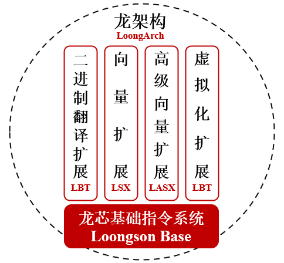
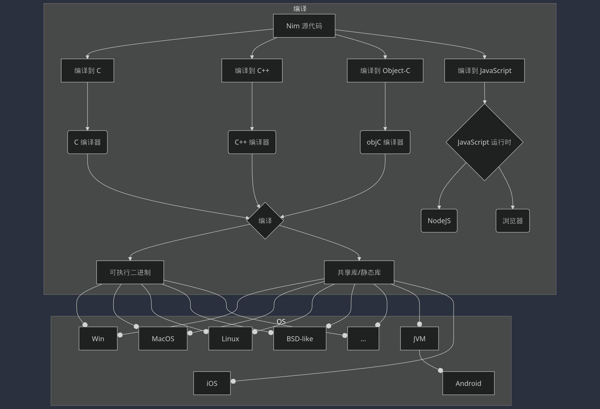
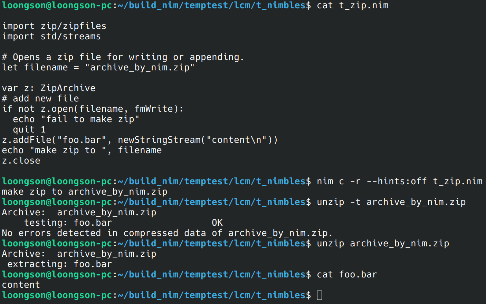

<div align="center">
    <h2> 基于开源操作系统开发应用程序-nim移植LoongArch </h2>
</div>

<div align="left">
    队名：nimble <br>
    成员：蔺春名、赵禹惟、李佳潼 <br>
    指导教师：曲海鹏 <br>
    学校：中国海洋大学 <br>
    所属方向：OS系统工具开发
</div>

## 1. 项目简介
在现有的 Nim 移植基础上，进一步 LoongArch 架构的移植，处理了等，实现 LoongArch 架构支持。搭建 LoongArch 编译环境，编译目标系统，并在LoongArch架构实机完成功能调试，并进行测试。形成[移植文档](./project-docs/移植文档.pdf)及[测试文档](./project-docs/测试文档.md)。

[功能演示视频](./project-docs/功能演示.mp4)请见：

官方的迁移提示： <https://nim-lang.org/docs/intern.html#porting-to-new-platforms>

## 1.1. 项目难点与意义
### 1.1.1. 项目难点
- Nim 相关教程，尤其是中文教程极少
- Nim 编译器为自举实现的，修改Nim编译器源码需要同时了解C和Nim

### 1.1.2. 项目意义
实现Nim到LoongArch(龙芯)的迁移：
- 完善国产龙芯CPU生态
- 为软件国产化提供更优方案进行探索
- 完成Nim语言编译器在国产龙芯CPU下的迁移，提高Nim跨平台性
- 推进Nim在软件开发中的应用
- 为龙芯架构提供更现代化、特性丰富的编译系统
- 为多个代码仓库提交龙芯相关贡献，助力国产处理器架构得到更广泛支持与认同


## 2. 题目分析和相关资料调研
### 2.1 Nim 语言
Nim语言作为静态类型的编译型系统级语言，因其简洁优雅而富含现代化特性的语法而拥有可超越Python的开发效率，语法简约而灵活，与此同时，却拥有接近C的运行效率，充分发挥了零成本（zero-overhand）的特色。它整合了Pascal，Python，Ada，Modula等众多语言的优秀特性，也给许多现代化语言的设计带来灵感，如Rust、Cangjie(仓颉)。
Nim代码在可以作为NimScript解释执行的同时，以编译执行作为主要运行方式，且在相当程度上做到了一套代码，多后段执行，即可编译为C、C++、JavaScript代码，拥有极高的跨语言性、语言互操作性和灵活的FFI，极大提高了开发的便携度。
不同于C的手动内存管理，也不同于C++/Rust的RAII，Nim使用ORC作为内存管理，即ARC+小型循环检测器，保证了内存安全的同时，也通过sink参数、copy on write等技术极大程度避免了对性能的影响。同时，也拜托了Rust风格的强制所有权检查带来的各种不便，极大提高了开发效率与开发负担。

Nim 内核提供了一系列的特性，包括：

- 内存管理(Memory Management)
- 并发(多进程以及多线程)、进程间通信([Channel](https://nim-lang.org/docs/system.html#Channel))、原子操作(如[atomics](https://nim-lang.org/docs/atomics.html)) 与 锁 ([lock](https://nim-lang.org/docs/locks.html))
- OOP、函数式等多种范式
- 健全的标准库与丰富的第三方库

### 2.2 Loongarch 指令集
龙芯架构 LoongArch 具有 RISC 指令架构的典型特征，其指令长度固定且编码格式规整，绝大多数指令只有两个源操作数和一个目的操作数，采用 load/store 架构，即仅有 load/store 访存指令可以访问内存，其它指令的操作对象均是处理器核内部的寄存器或指令码中的立即数。
<br>
龙芯架构采用基础部分 (Loongson Base) 加扩展部分的组织形式 (如图 1:1 所示)。其中扩展部分包括：二进制翻译扩展 (Loongson Binary Translation，简称 LBT)、虚拟化扩展 (Loongson Virtualization，简称 LVZ)、向量扩展 (Loongson SIMD Extension，简称 LSX) 和高级向量扩展 (Loongson Advanced SIMDExtension，简称 LASX)。



- 龙芯架构的基础部分包含非特权指令集和特权指令集两个部分，其中非特权指令集部分定义了常用的整数和浮点数指令，能够充分支持现有各主流编译系统生成高效的目标代码。
- 龙芯架构的虚拟化扩展部分用于为操作系统虚拟化提供硬件加速以提升性能。这部分涉及的基本上都是特权资源，包括一些特权指令和控制状态寄存器、以及在例外和中断、存储管理等方面添加新的功能。
- 龙芯架构的二进制翻译扩展部分用于提升跨指令系统二进制翻译在龙芯架构平台上的执行效率。其在基础部分之上进行扩展，同样包含非特权指令集和特权指令集两个部分。
- 龙芯向量指令扩展和高级向量指令扩展两部分均是采用 SD 指令来加速计算密集型应用。两个扩展部分在指令功能上基本一致，区别在于向量指令扩展操作的向量位宽是 128 位而高级向量指令扩展操作的向量位宽是 256 位。

### 2.3 龙芯 3A5000 处理器
龙芯 3A5000/3B5000 是面向个人计算机、服务器等信息化领域的通用处理器，基于龙芯自主指令系统（LoongArch）的 LA464 微结构，并进一步提升频率，降低功耗，优化性能。

## 3. 项目文件说明
TODO: ...

<pre>
<code>.
├── LICENSE*                     
├── README.md*                   
├── src/                         # 迁移相关文件和代码的目录
│   ├── BUILD.gn*                
│   ├── LICENSE*                 
│   ├── testresult/              # 特定架构的内核代码目录
│   │   ├── bin/                 # 生成的二进制文件
│   │   ├── build/               # 生成的用于安装的C代码
│   │   └── lib/                 # Nim库
│   ├── Nim/                     # 特定架构的内核代码目录
│   │   ├── bin/                 # 生成的二进制文件
│   │   ├── build/               # 生成的用于安装的C代码
│   │   ├── compiler/            # Nim自身的编译器;注意这个代码是从Pascal写的引导版本翻译过来的，所以该代码不是一个优秀Nim代码的示例
│   │   ├── config/              # Nim的配置文件
│   │   ├── dist/                # 发行版的其他包
│   │   ├── doc/                 # 文档;reStructured files的一个分支
│   │   ├── lib/                 # Nim库
│   │   └── csources_v2          # 编译第一版Nim的C代码
│   ├── debugcommands/           # 调试命令相关文件的目录
│   ├── top/                     # 内核顶层代码的目录
│   └── vm/                      # 虚拟机相关代码的目录
├── project-docs                 # 存放相关文档
└── assets/                      # 图片相关文件</code>
</pre>

## 4. 搭建开发环境
### 4.0 在已受支持的平台编译Nim
ref: <https://nim-lang.org/install_unix.html>

```shell
git clone git@github.com/nim-lang.Nim  # 或到 https://nim-lang.org/install.html 下载打包版本
cd Nim/
sh build.sh  # 这一步会使用https协议clone github上的csources， 如果不能畅连，先使用ssh协议预先clone下来即可避免其自动克隆
             #  git clone git@github.com:nim-lang/csources_v2
bin/nim c koch
./koch boot -d:release
./koch tools
```

### 4.1 准备工作
我们此次选择以loongson用户的HOME目录为工作目录

即 `~loongson`

好处是即使登陆为root用户也能正常执行

创建用户的命令： `useradd --create-home loongson`

> 若不希望在loong的HOME位于`/home/`下 也可以相应地使用 `--home-dir DIR` 来指定其他路径

---

上文提到:

Nim编译器 由 Nim语言实现

想要编译Nim编译器，就需要现有一个Nim编译器。

但是对于尚无法取得Nim编译器的平台(如尚未完成迁移的平台）,
这陷入了类似鸡生蛋的循环。

这时候，得益于Nim可以编译为C的特性，我们可以从相应的C代码编译得到第一个Nim,

该Nim一般不适于直接使用（一般版本较低）， 而是用于编译Nim编译器源代码

通过引入C这一被广泛支持的语言作为中间层，极大地扩展了Nim的普适性、减小了迁移难度。

Nim官方维护了大量平台的C source，版本号跟进Nim主版本号，为v2：


<https://github.com/nim-lang/csources_v2>


### 4.2 下载 C 编译器
如果系统尚无CC (C Compiler)， 则安装一个：

> 由于所使用的LoongArch64架构上安装的系统为UOS，所以包管理器同Debian, Ubuntu
> 
```shell
sudo apt update  # 更新索引
sudo apt install gcc  # 安装 CC
```

另，视情况可以再安装git （如果需要使用Nim的版管理器nimble、或使用git来clone本仓库）

> 其他系统使用其他的包管理器， 如使用ArchLinux(支持LoongArch64), 则命令为 `sudo pacman -S gcc git`


### 4.3 下载 C source & 源码
```shell
 如许获取最新编译器源码: 
 git clone git@github.com/nim-lang/Nim
 如需最新csources代码：
 git clone git@github.com:nim-lang/csources_v2 Nim/csources_v2
```
这些仓库已经作为submodule置于本项目的子文件夹下（使用文件夹路径设置url而非上述链接）

```shell
git clone https://gitlab.eduxiji.net/T202410423994345/project2608128-274097.git ~loongson/
```

### 4.4  编译
首先使用csources编译得到第一版Nim
<br>
详情见 [build nim from csource.md](./project-docs/steps/build_nim_from_csource.md)
<br>
使用 koch 进行编译。Nim使用koch负责编译自身编译器及相关工具:

详情见 [build with csource nim](./project-docs/steps/build_with_csource_nim.md)

### 4.5 安装
编译成功的nim以及各种工具位于bin下，要将他们移动至系统bin目录下：

见 [makeup to system](./project-docs/steps/makeup_to_system.md)


### 4.6 Nim REPL(交互执行环境)
执行以下命令即可启动 Nim 的 REPL：
```shell
nim secret
```
> 因为目前REPL模块目前(截至nim v2.2.0)尚未完善，故没有被公开出来。
我们在阅读源码是发现了这个功能，认为很有用，并且实际可以在相当程度上正常使用，所以在此用于展示

## 5. 移植过程
### 5.1 Nim编译过程探讨
要想移植Nim编译器，首先我们需要搞懂Nim编译器是如何编译Nim语言源代码的：

下面我们将简单介绍一下:

#### 5.1.1 从 Nim 代码编译到后端代码
正如C代码的-c(compile-only)选项编译到汇编，是由于C代码的目标语言为asm，有时称asm为C的后端
<br>
Nim则支持编译到多种后端，C、C++、ObjC、JS
<br>
作为这种特性优越性的一个例子，一些Nim开发的游戏可以既可以编译为主机游戏，还能不加改动地编译为网页游戏。

#### 5.1.2 Nim VM & 解释执行
除了上述的能编译到后端外(通常称为编译执行)，Nim还支持解释执行。
能解释执行的Nim代码通常被称作NimScript，是Nim语言的一个子集。
<br>
我们知道，Python代码由Python解释器解释执行，也称由Python虚拟机(VM)执行。
<br>
同理，Nim的这种能解释执行的特性，由Nim编译器内置的小型VM实现。
<br>
同时，Nim编译器通过内置的VM支持 `编译期求值`，
<br>
比C++11的constexpr 和 Rust 的 `const fn` 等更加灵活。


在 boot-shim 跳转到内核之后，先进行内核启动的准备工作，比如保存启动参数和内核物理地址，同时初步初始化页表，并映射到地址空间，以便内核进入 C 环境。在 C 语言环境之后，利用 C 语言的高级特性和丰富的库函数简化开发和维护，进一步完成内核启动后期的工作，包括打开内存管理单元、线程初始化、虚拟内存初始化、内核初始化以及平台初始化等，同时启动初始用户空间进程。

### 5.2 现有移植的整理和推进
#### 5.2.1 编译准备
- [x] GitHub开源仓库 <https://github.com/nim-lang/Nim>
- [x] 在install.ini增添支持 <https://github.com/nim-lang/Nim/pull/23672>
- [x] 为Nim的符号常量hostCPU增添可能的项"loongarch64" <https://github.com/nim-lang/Nim/pull/19233>

#### 5.2.2 第三方库适配
- [x] 测试并为第三方库 jester 添加 LA 支持
- [x] 测试并为第三方库 zip 添加 LA 支持
- [x] 测试并为第三方库 nimpylib 添加 LA 支持

在Nim的官方测试中，一些第三方库也被加入到了测试中，包括 

- 全栈开发库 dom96/jester
- zip 库 nim-lang/zip

另外，为了

##### nimble packages.json 配置
而 nim使用 nimble 为包管理器，

默认的包安装目录为 `~/.nimble`。

依靠上述目录下的 `package*.json` 作为包索引， 如果不存在则从 `https://github.com/nim-lang/packages` 下载。

照样可以选择先使用ssh协议克隆后cp到目录下:

```shell
git clone git@github.com:nim-lang/packages
cp packages/packages.json ~/.nimble/
```

##### 安装第三方包
在第三方库和 system/ulib 中，有许多库涉及到架构相关的代码，这部分在需要我们在移植内核之前先补充完成。主要涉及到架构相关的第三方库有`musl`和`libunwind`，这些库我们都进行了 backport，添加了对 Loongarch 的支持。

此外还有`system/ulib`下一些用户态函数会使用到的系统库（如`inspector`，`libzbi`等），也做了移植和完善。

###### zip
直接运行，报错：

```plain
could not load: libzip(|2).so(|.4|.2|.1|.0)
```

说明没有共享库

安装(还以apt为例)：

```shell
sudo apt install libzip-dev
```

之后即正常运行




## 6. 项目成果
移植总代码量改动约 10000 行，实现了内核启动、内核核心功能（如虚拟内存管理、线程管理、异常处理等）以及围绕内核调用衍生出的其他应用功能。


### 6.1 内核系统调用
- 外围设备地址映射和管理功能
- 自旋锁获取和解锁
- 线程创建和销毁
- 异常处理机制
- 部分多处理器相关操作
- 特性查询和缓存信息获取
- 虚拟内存管理单元的核心功能
  - ASID 的分配与释放
  - 页表的查询、分配和释放；权限保护
  - TLB 管理
  - 虚拟内存映射相关功能，地址空间初始化

### 6.2 基于上述功能实现的其他内核功能
- Mutex（互斥锁）的功能，用于线程同步和互斥访问共享资源。
- 信号量（Semaphore）的功能，用于线程之间的同步和资源管理。
- 内核定时器子系统，用于管理系统中的定时器和定时任务。
- 延迟处理函数（Deferred Procedure Call，DPC）机制，用于在内核中执行一些延迟且不立即执行的操作。
- 物理内存管理器（Physical Memory Manager，PMM）的功能。
- 虚拟内存管理器（Virtual Memory Manager，VMM）的功能。
- 业策略管理器（Job Policy Manager），用于管理作业（Job）的安全策略和行为规则。
- 基于链表的内存缓冲区管理器（MBufChain），用于管理大小可变的内存缓冲区。

### 6.3 应用演示
## <center>Nim 展示文档<center>

#### （一）Nim 模块编译测试
*在 build_nim/Nim 下进行编译测试*

```bash
./koch test
```


#### （二）Nim 基本命令信息
- 查看帮助文档

```powershell
nim --help
```

- 查看 Nim 编译器版本信息

```powershell
nim --version
```

#### （三）Nim 交互式执行命令
- 直接执行表达式或命令

```powershell
nim --hints:off --eval:"echo 5 * 4"	
```

- Nim 交互式运行环境 (REPL)，

```powershell
nim --hints:off secret	
```

*以下为简单测试示例*

```powershell
>>> echo type(1.0)

>>> high(int)

>>> from std/math import sqrt
>>> sqrt 9.1
```

#### （四）Nim 基本命令行操作
*编写 testArgs.nim 文件内容如下*

```nim
##[
	一个简单的*IO*示例
- 读取一行命令行输入
- 输出`*result: *` + 输入
]##

template main* =
  ## doc for `main`
  let name = readLine(stdin)
  echo "result: ", name
    
main
```

进行相关编译执行测试

- 编译并执行 .nim 文件

```powershell
nim r --hints:off testArgs.nim
nim 					//执行输入
```

- 编译生成可执行文件

```shell
nim c --hints:off testArgs.nim	
./testArgs
Nim						//执行输入
```

- 根据源代码生成文档

```shell
nim doc --hints:off testArgs.nim
```

## 7. 测试
Nim编译器的测试使用了自带的`testament`工具，普通测试主要是对内核的功能进行测试，单元测试主要是对内核的各个模块进行测试。详细测试过程见[测试文档](https://gitlab.eduxiji.net/T202410423994345/project2608128-274097/-/tree/main/project-docs/steps/test.md)。

其中，在已移植的功能中，大部分都能通过单元测试。其中有部分尚未能通过的测试样例的功能争取在决赛中完成移植

## 8. 演示


## 9. 下一步工作
- [ ] 将已有迁移工作整理并向[Nim仓库](https://github.com/nim-lang/Nim)和[csources\_v2](https://github.com/nim-lang/csources_v2)提交PR
- [ ] 完成Ubuntu, Debian等Linux发行版提交Nim的LoongArch64的包的发行
- [ ] 升级编译工具链
- [ ] 进一步编写测试样例
- [ ] 在“新世界”龙芯上完成测试(目前所用为 “旧世界”）
- [ ] 探究测试时发现的valigrind对LoongArch的不完善支持的问题

## 10. 比赛收获
经历这次比赛，我们收获颇丰。我们11月份决定参加这个赛道，当时我们对于LoongArch64架构移植还是一窍不通的，纯粹是由于发现在手头的LoongArch架构Linux下无法直接使用包管理器安装Nim，对此决定为开源社区与国产CPU架构发展贡献薄力，所以前期花了不少时间组织队伍成员一起整理Nim编译器源代码和研究 Loongarch 特性。最后经过长时间的准备之后开始了代码的编写，从获得第一个能在LoongArch下运行的Nim编译器开始，一步步修复测试问题，逐渐深入理解LoongArch架构以及Nim编译器的设计，最后完成了这次编译器的移植。

另外，移植一开始是仿照已有的 mips64 架构相关的代码，而后面我们就开始自己理解并编写适用于 Loongarch 的代码，这大大提升了我们 Loongarch 的理解，以及对 Nim 编译器从启动到功能实现的全流程的理解。在调试错误时，因为繁杂的函数调用及与C函数的混合，导致错误定位和追根溯源花费了大量的时间，但是这个过程也给我们带来了很大的启发，学到很多。

最后，我们的工作离不开我们的指导老师曲海鹏老师，是老师的支持让我们有机会站在这里，让我们有机会与来自全国各个高校的优秀队伍一拼高下。同样也感谢大赛各组织机构及专委会，我们将牢记此次竞赛积累的经验，继续秉持对计算机系统的热情，虚极静笃、沉淀自我，在未来为这一领域做出更有价值的成绩。

## 11. 开源声明
本[项目文档](https://gitlab.eduxiji.net/T202410423994345/project2608128-274097/-/tree/main/project-docs)均采用 [CC BY-NC-SA 4.0](https://creativecommons.org/licenses/by-nc-sa/4.0/) 许可协议。

本项目(以及submodule)相关commit均采用[MIT开源协议](http://opensource.org/licenses/MIT)

## 12. 参考
- Nim 官方文档： [Nim Docs](https://nim-lang.org/docs/)
- Nim 源码： [Nim (nim-lang)](https://github.com/nim-lang/Nim)
- Nim Docs of [Porting to New Platforms](https://nim-lang.org/docs/intern.html#porting-to-new-platforms)
- Nim [install on UNIX](https://nim-lang.org/install_unix.html)
TODO: add more
- 关于 LoongArch 架构文档：
  - [龙芯架构文档](https://loongson.github.io/LoongArch-Documentation/README-CN.html)
  - [1. Introduction to LoongArch — The Linux Kernel documentation](https://www.kernel.org/doc/html/next/loongarch/introduction.html)
  - [loongarch 架构介绍（四）TLB 异常处理 -51CTO.COM](https://www.51cto.com/article/747031.html)
  - [第 3 章 特权指令系统 | 计算机体系结构基础](https://foxsen.github.io/archbase/)


